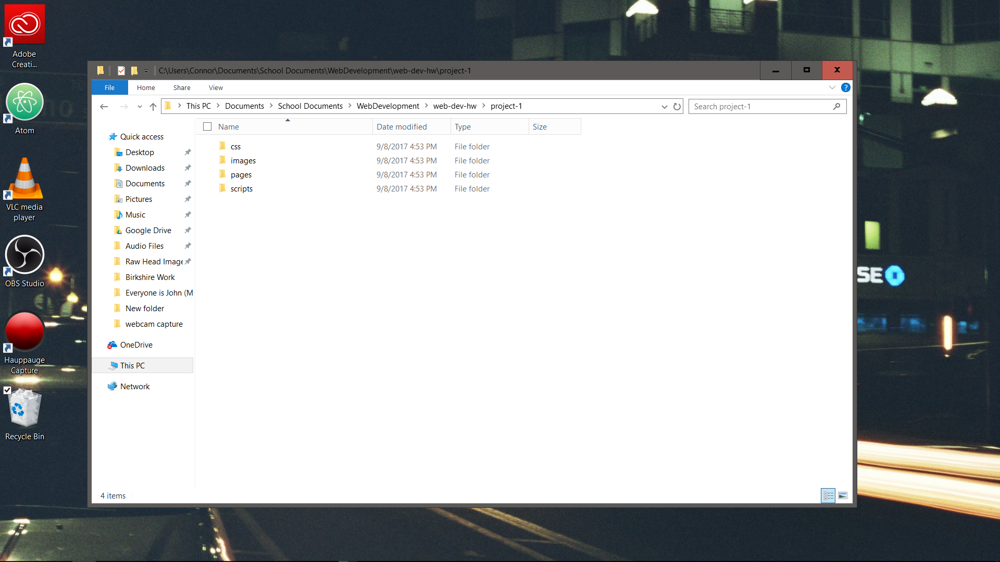

# My First README.md
## Connor Bryan ##

** README Cheatsheat **

*Use as a reference point*

1. lists are created with numbers
2. they have propper indentation without assistance


* There is not a number system with an astrisk
* simply one astrisk is needed to initalize the list

To create a coded statement use the back tick and the result is as followed

```
<html>
  <body>
  Hello world
  </body>
</html>
```

***
Here is  a link to youtube! <https://www.youtube.com>

This is an inline logo 

Another line of text
